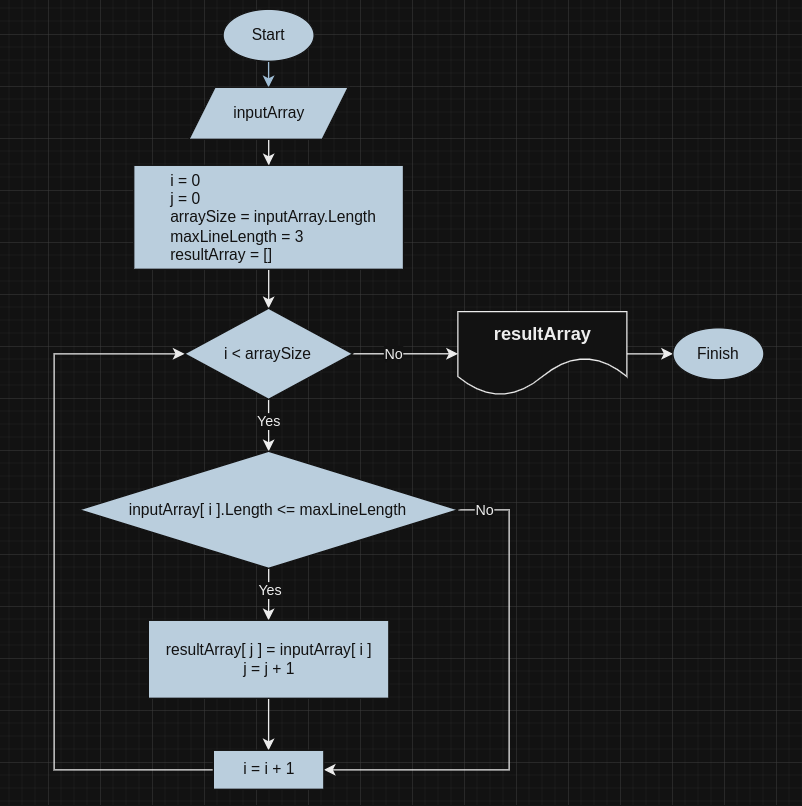

# Проект: Фильтрация массива строк

## Описание задачи
Задача заключается в написании программы, которая принимает на вход массив строк и максимальную длину строки. Программа формирует новый массив, содержащий только те строки из исходного массива, длина которых меньше или равна заданной максимальной длине. Программа должна быть написана на языке C# без использования коллекций, работая исключительно с массивами.

## Блок-схема алгоритма


## Алгоритм
1. Функция `GetShortStringsArray` принимает на вход исходный массив строк `array` и максимальную длину строки `maxLineLength`.
2. Внутри функции происходит подсчет количества строк, длина которых меньше или равна `maxLineLength`.
3. Создается новый массив `result` с длиной, равной количеству найденных коротких строк.
4. Цикл проходит по исходному массиву и копирует строки, длина которых меньше или равна `maxLineLength`, в новый массив `result`.
5. Функция возвращает отфильтрованный массив `result`.

6. Функция `PrintArray` принимает на вход массив строк и выводит его элементы в консоль.

7. В функции `Main` происходит следующее:
   - Задается максимальная длина строки `maxLineLength`.
   - Вызывается функция `GetShortStringsArray` с исходным массивом `array` и `maxLineLength`, результат сохраняется в `resultArray`.
   - Выводятся исходный и отфильтрованный массивы с помощью функции `PrintArray`.

8. В конце программы создаются три исходных массива `inputArray1`, `inputArray2` и `inputArray3`, и для каждого из них вызывается функция `Main`.

## Примеры
Входные данные:
```
["Hello", "2", "world", ":-)"]
maxLineLength = 3
```
Выходные данные:
```
Исходный массив: Hello 2 world :-)
Новый массив: 2 :-)
```

Входные данные:
```
["1234", "1567", "-2", "computer science"]
maxLineLength = 3
```
Выходные данные:
```
Исходный массив: 1234 1567 -2 computer science
Новый массив: -2
```

Входные данные:
```
["Russia", "Denmark", "Kazan"]
maxLineLength = 3
```
Выходные данные:
```
Исходный массив: Russia Denmark Kazan
Новый массив:
```

## Использование контроля версий
В процессе работы над проектом был использован контроль версий с помощью Git. Основные этапы разработки, такие как создание блок-схемы, написание документации и программного кода, были зафиксированы в отдельных коммитах.
